 

<strong>I build experiments to measure how robots and AI agents adapt, cooperate, and fail.</strong>

  

Eight rotating research notes · Click the carousel for evidence and sources

  

<table>
<tr>
<td align="center" width="33%">
<a href="https://github.com/Legedith/BrushOS-Robotic-painting-in-action"><strong>EMBODIED AI</strong></a> 
BrushOS
</td>
<td align="center" width="33%">
<a href="https://github.com/Legedith/First-Keats-Retrieval-Persona"><strong>PERSONA + MEMORY</strong></a> 
Retrieval experiments
</td>
<td align="center" width="33%">
<a href="./FIELD_NOTES.md"><strong>RESEARCH NOTES</strong></a> 
Evidence behind the slides
</td>
</tr>
</table>

 

